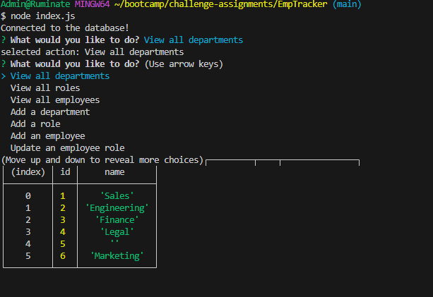
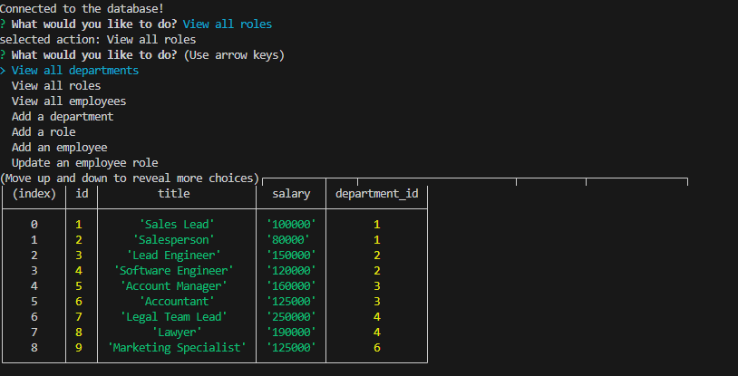
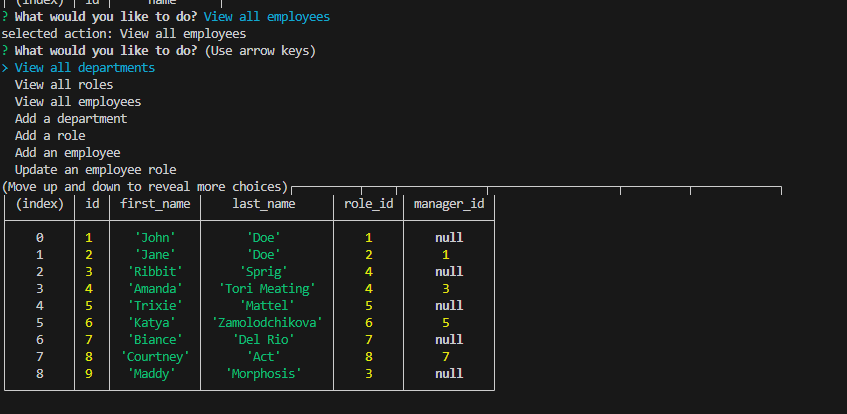
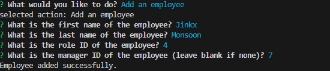

# EmpTracker

# Descpription 

Employee Tracker is a simple command-line application that allows users to manage employee data, departments, roles, and more.

# Features
- View all departments, roles and employees
- Add a new department, role or employee
- Update an employee's role

# Installation
- Install dependencies by running npm i in terminal

# Usage
- Start the application by running node index.js in terminal
- follow the prompts

# Techonologies used
- Node.js
- Inquirer.js
- MySQL2

# [WALKTHROUGH VIDEO](https://drive.google.com/file/d/1wLZKKIPq5254AGwHnLImIvUJ_JIS0COW/view)

